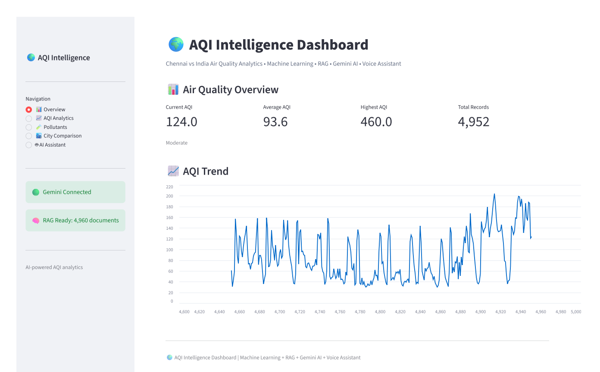
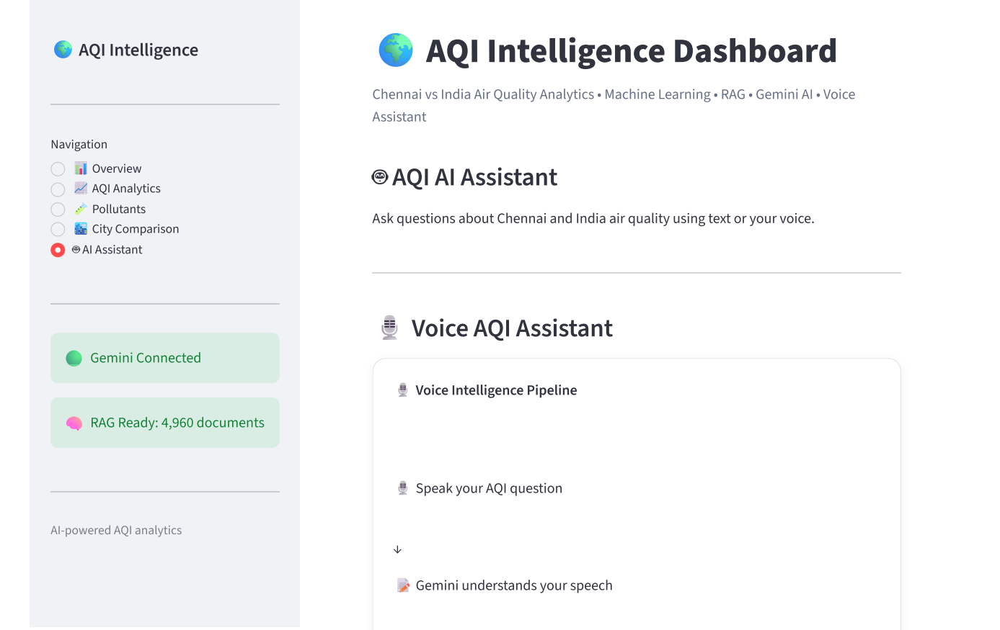
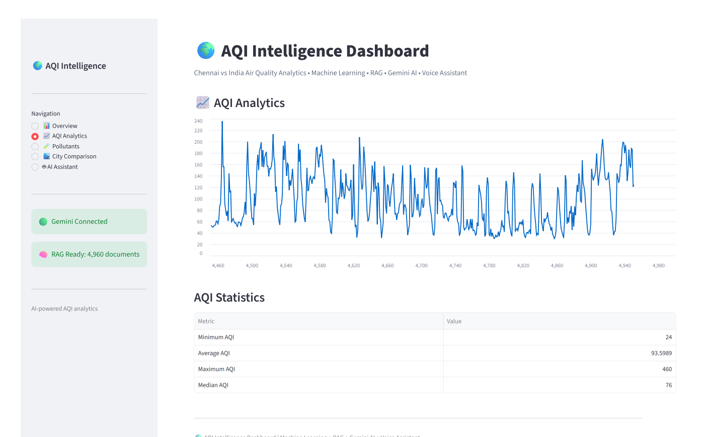
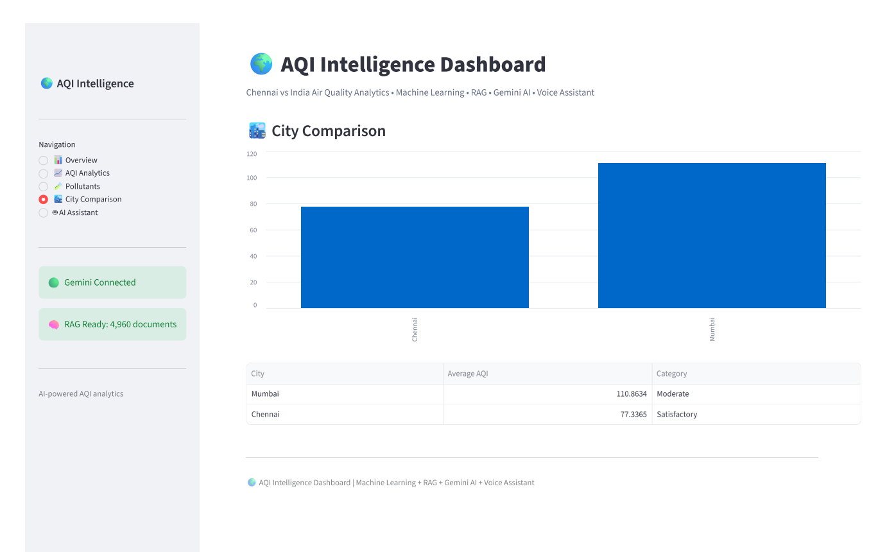

# 🌍 AQI Intelligence Analytics

**AI-powered Chennai vs India Air Quality Analytics & Forecasting Dashboard** — combining machine learning forecasts, a RAG-powered Gemini chatbot, conversation memory, and a voice assistant in one Streamlit app.

<p align="left">
  <a href="https://aqi-intelligence-analytics.streamlit.app"></a>
</p>

**🔗 Live Demo:** [aqi-intelligence-analytics.streamlit.app](https://aqi-intelligence-analytics.streamlit.app)

<p align="left">
  
  
  
</p>

---

## 📖 Overview

AQI Intelligence Analytics is an end-to-end air quality intelligence platform. It compares **Chennai's air quality against national (India) trends and other major cities** (Delhi, Mumbai, Bangalore, Hyderabad), forecasts future AQI using trained ML models, and lets users **ask natural-language questions** about the data through a Gemini-powered chatbot that:

- Retrieves relevant context using a custom **RAG (Retrieval-Augmented Generation)** pipeline over the AQI dataset
- Remembers prior turns in the conversation (**conversation memory**)
- Accepts **voice input** (speech-to-text) and can **speak responses back** (text-to-speech)

The result is a dashboard that doesn't just visualize pollution data — it lets you *talk* to it.

---

## 📸 Screenshots

| Dashboard Overview | AI & Voice Assistant |
|---|---|
|  |  |

| AQI Analytics & Trends | City Comparison |
|---|---|
|  |  |


---

## ✨ Features

- 📊 **Interactive Dashboard** — KPI cards, AQI trend charts, and anomaly views built with Plotly and Streamlit
- 🏙️ **Chennai vs India Comparison** — benchmark Chennai's pollution levels against national and multi-city data (Delhi, Mumbai, Bangalore, Hyderabad)
- 🔮 **ML-based Forecasting** — pre-trained scikit-learn models (`Chennai_AQI_Final_Model.pkl`, `India_AQI_Final_Model.pkl`) predict future AQI values
- 🚨 **Anomaly Detection** — flags unusual spikes/drops in air quality via `AQI_Dashboard_With_Anomalies.csv`
- 🤖 **RAG-powered Gemini Chatbot** — TF-IDF + cosine-similarity retrieval over curated AQI documents, feeding relevant context into Gemini for grounded answers
- 🧠 **Conversation Memory** — the chatbot remembers recent turns in a session for coherent follow-up questions
- 🎙️ **Voice Assistant** — speech-to-text for asking questions out loud, and Gemini TTS for spoken answers
- 📁 **Rich Data Layer** — multiple city datasets, a data dictionary, and KPI/model-performance summaries included out of the box

---

## 🛠️ Tech Stack

| Layer | Technology |
|---|---|
| **Language** | Python 3.10+ |
| **App / UI** | Streamlit |
| **Data Processing** | pandas, numpy, scipy |
| **Machine Learning** | scikit-learn, joblib (model persistence) |
| **Visualization** | Plotly |
| **AI / LLM** | Google Gemini API (`google-genai`) — text generation, speech-to-text, and text-to-speech |
| **RAG Pipeline** | TF-IDF vectorizer + cosine similarity search over `rag_documents.json` / `rag_matrix.npz` |
| **Data Sources** | Open-Meteo Air Quality API (CAMS global domain), GeoNames city metadata |

---

## 📂 Repository Structure

```
AQI-Intelligence-Analytics/
├── app.py                              # Main Streamlit application (dashboard + chatbot + voice)
├── requirements.txt                    # Python dependencies
├── .env.example                        # Sample environment variables (Gemini API key, etc.)
├── project_info.json                   # Project metadata
├── data_dictionary.csv                 # Column-level description of the datasets
├── city_info.csv                       # City identifiers, coordinates, admin areas, population
├── air_quality_historical.csv          # Raw historical air quality time series
│
├── Chennai_AQI_Dataset.csv             # Chennai-specific AQI dataset
├── Delhi_AQI_Dataset.csv               # Delhi AQI dataset
├── Mumbai_AQI_Dataset.csv              # Mumbai AQI dataset
├── Bangalore_AQI_Dataset.csv           # Bangalore AQI dataset
├── Hyderabad_AQI_Dataset.csv           # Hyderabad AQI dataset
│
├── Final_AQI_Dashboard_Data.csv        # Cleaned/merged dataset powering the dashboard
├── AQI_Dashboard_With_Anomalies.csv    # Dataset with anomaly flags
├── AQI_KPI_Summary.csv                 # Pre-computed KPI summary stats
├── Model_Performance_Summary.csv       # Model evaluation metrics
│
├── Chennai_AQI_Predictions.csv         # Forecast output for Chennai
├── India_AQI_Predictions.csv           # Forecast output for India
├── Chennai_AQI_Final_Model.pkl         # Trained forecasting model (Chennai)
├── India_AQI_Final_Model.pkl           # Trained forecasting model (India)
│
├── rag_documents.json                  # Source documents for the RAG chatbot
├── rag_matrix.npz                      # Pre-computed TF-IDF sparse matrix for retrieval
├── tfidf_vectorizer.pkl                # Fitted TF-IDF vectorizer used at query time
│
└── streamlit.log                       # Runtime log file
```

---

## 🚀 Getting Started

### Prerequisites

- Python 3.10 or higher
- A [Google Gemini API key](https://ai.google.dev/) (required for the chatbot and voice features)
- `pip` for installing dependencies

### 1. Clone the repository

```bash
git clone https://github.com/vijii30/AQI-Intelligence-Analytics.git
cd AQI-Intelligence-Analytics
```

### 2. Create a virtual environment (recommended)

```bash
python -m venv venv
source venv/bin/activate      # on Windows: venv\Scripts\activate
```

### 3. Install dependencies

```bash
pip install -r requirements.txt
```

### 4. Configure environment variables

Copy `.env.example` to `.env` and add your Gemini API key:

```bash
cp .env.example .env
```

```env
GOOGLE_API_KEY=your_gemini_api_key_here
```

> ⚠️ **Note:** `app.py` currently references data/model paths under `/content/AQI_PROJECT/...` (a Colab-style layout: `outputs/`, `rag/`, `models/`). If you're running locally, either recreate that folder structure and copy the CSV/PKL/JSON files into the matching subfolders, or update the `PROJECT`, `OUTPUT_DIR`, `RAG_DIR`, and `MODEL_DIR` constants near the top of `app.py` to point at the repo root.

### 5. Run the app

```bash
streamlit run app.py
```

The dashboard will open automatically in your browser at `http://localhost:8501`.

---

## 💬 Usage

1. Launch the app and explore the **AQI dashboard** — trends, KPIs, and city comparisons.
2. Open the **AI Assistant** panel and ask questions in plain English, e.g.:
   - *"How does Chennai's AQI compare to Delhi this year?"*
   - *"What's driving the recent spike in PM2.5?"*
3. Use the **voice assistant** to ask a question by speaking instead of typing, and optionally have the answer read back to you.
4. Review the **forecast tab** to see predicted AQI values for upcoming periods.

---

## 📊 Data Sources

- Air quality time series retrieved via the **Open-Meteo Air Quality API** (`cams_global` domain)
- City metadata (coordinates, administrative areas, population) derived from the **GeoNames** city list

---

## 🤝 Contributing

Contributions, issues, and feature requests are welcome. Feel free to check the [issues page](https://github.com/vijii30/AQI-Intelligence-Analytics/issues) or open a pull request.

1. Fork the project
2. Create your feature branch (`git checkout -b feature/amazing-feature`)
3. Commit your changes (`git commit -m 'Add amazing feature'`)
4. Push to the branch (`git push origin feature/amazing-feature`)
5. Open a pull request


---

## 👤 Author

**Vijayalatha P([vijii30](https://github.com/vijii30))**

If you find this project useful, consider giving it a ⭐ on GitHub!
